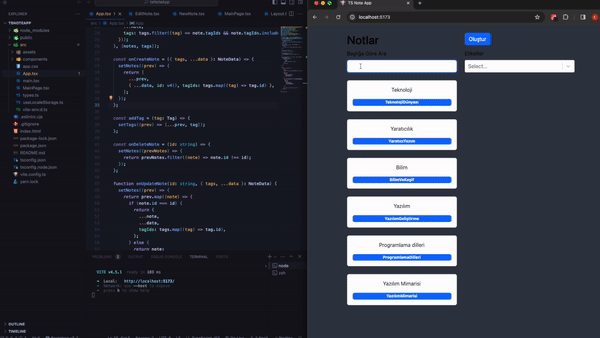

# React Vite Props Drilling, Custom Hook Projesi

Bu proje, React ve Vite kullanarak geliştirilmiş bir örnektir. Temel olarak, "props drilling" konseptini kullanarak veri iletimini nasıl yöneteceğinizi, aynı zamanda özel bir kancayı (custom hook) nasıl oluşturup kullanabileceğinizi ve nested route'ları nasıl kullanacağınızı göstermektedir.

# kütüphaneler

- react-router-dom
- react-bootstrap bootstrap
- react-select

